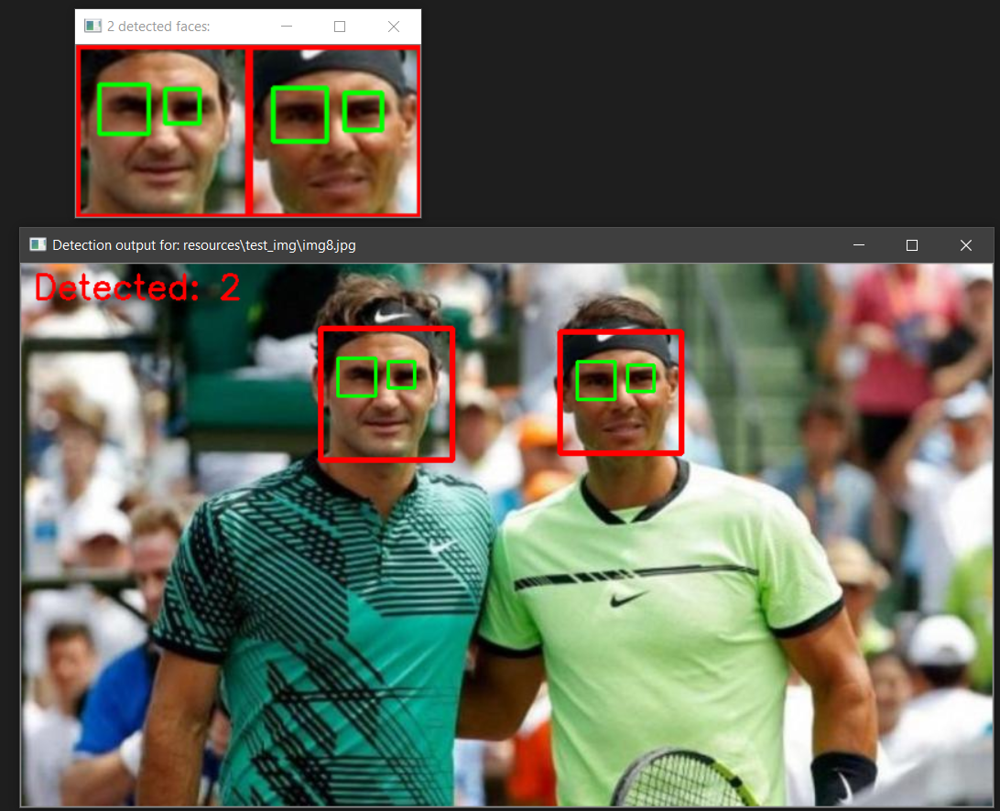
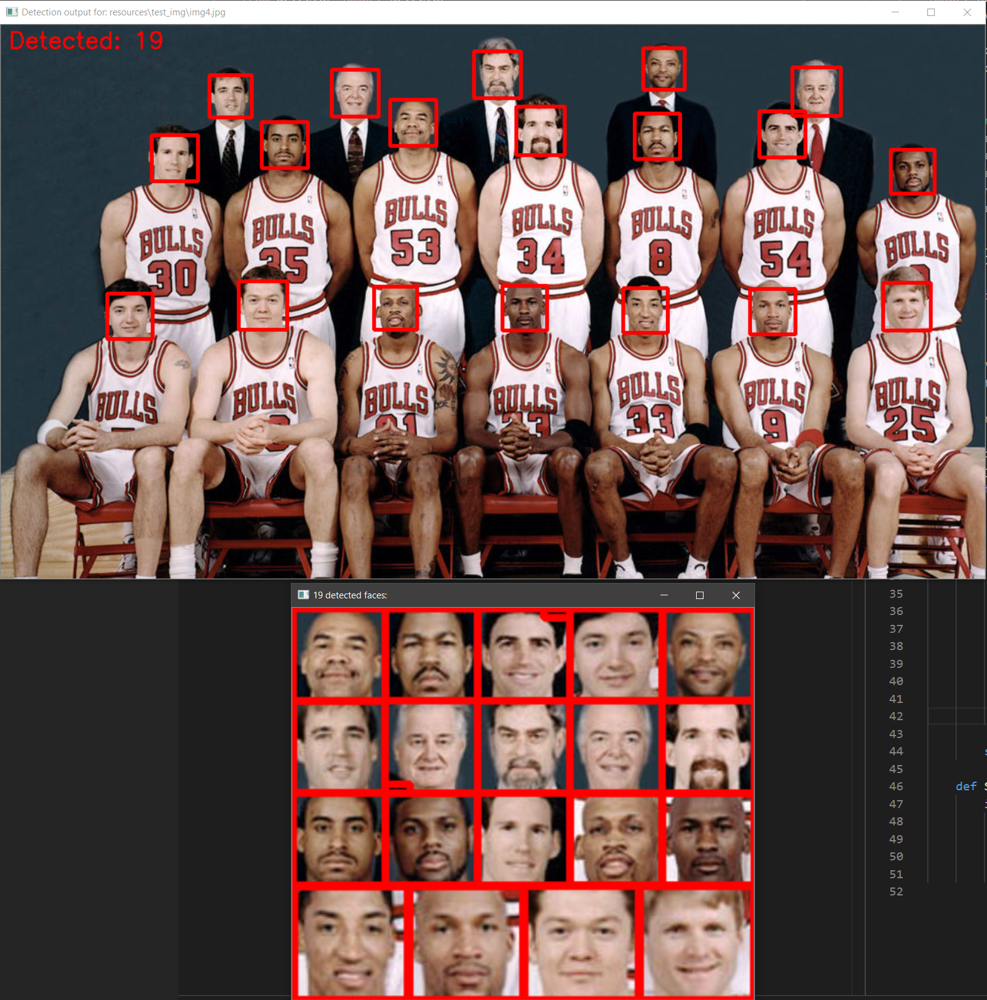
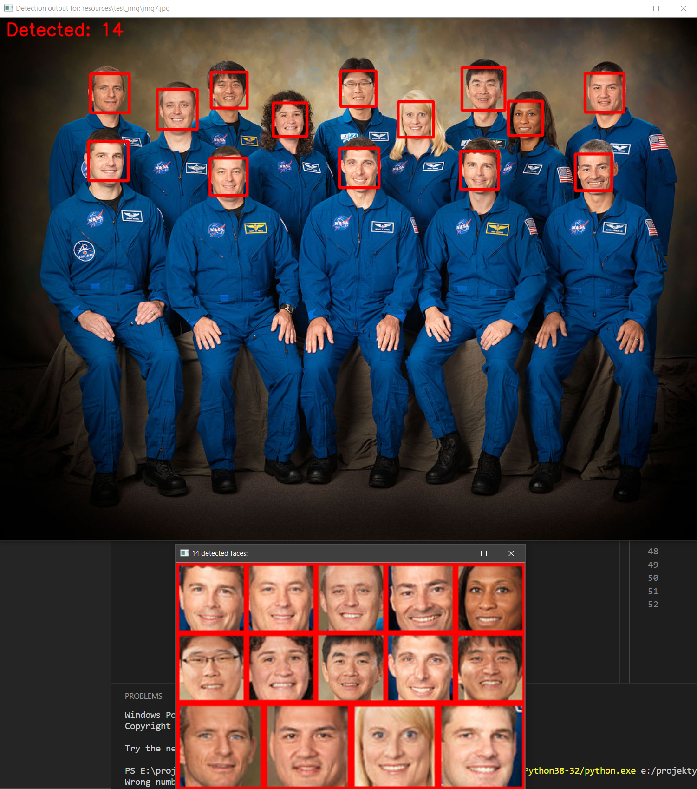

# Facedetector      


Facedetector is Python script made using OpenCV library, \
which detects faces and eyes on provided pictures in .jpg and .png format. \
Script marks detected faces right on the provided picture and also tries to mark detected eyes, \
only in case of detection all of eyes (in association with number of detected faces). \
Another feature is making mosaic with detected faces in case of detection more than one face on the picture.

## Prerequisites

* `Python 3` and `pip` installed on your system,
* installed all of required packages - to make this use this command in project directory `pip install -r requirements.txt`

## Running

To run Facedetector just type this command in project directory in your terminal: \
`python .\src\app.py pathToImage`, where `pathToImage` is path to your image, which will be processed

In case of wrong input image format specified, you will get this error information:
```
Wrong input file! Image has to have .jpg or .png extension.
```

In case of not input image specified, you will get this error information:
```
Wrong number of parameters! To run program type: app.py "image"
```

To exit script just click any button.

## Screenshots

Screenshots showing script's work (images from **./resources/test_img** directory was used):







## Troubleshooting

If Facedetector does not detect faces properly, try to use image in higher resolution or better quality.

## Technologies and tools

* Python 3.8.3,
* OpenCV 4.2.0.34,
* NumPy 1.18.4,
* Pillow 7.1.2,
* pycodestyle 2.6.0,
* PyParsing 2.4.7,
* Visual Studio Code with autopep8
